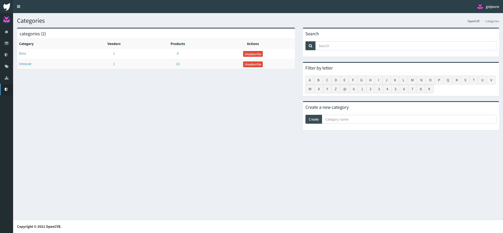
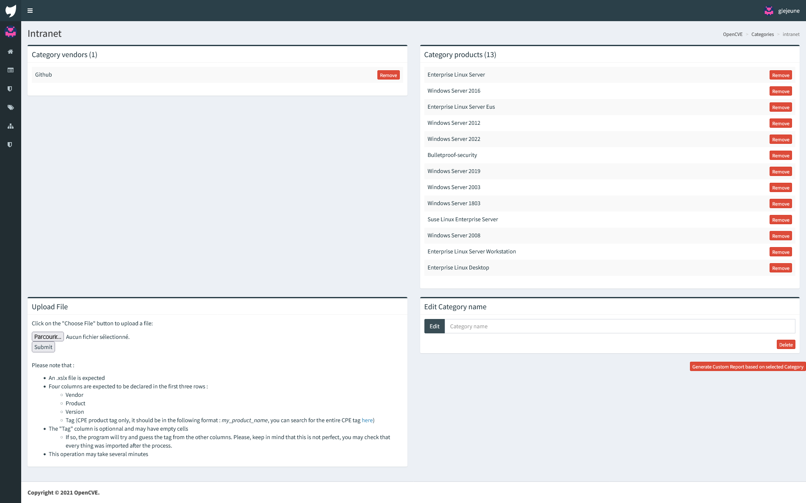
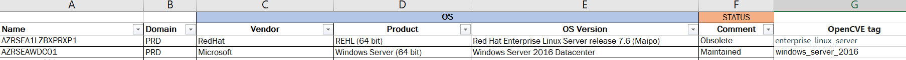
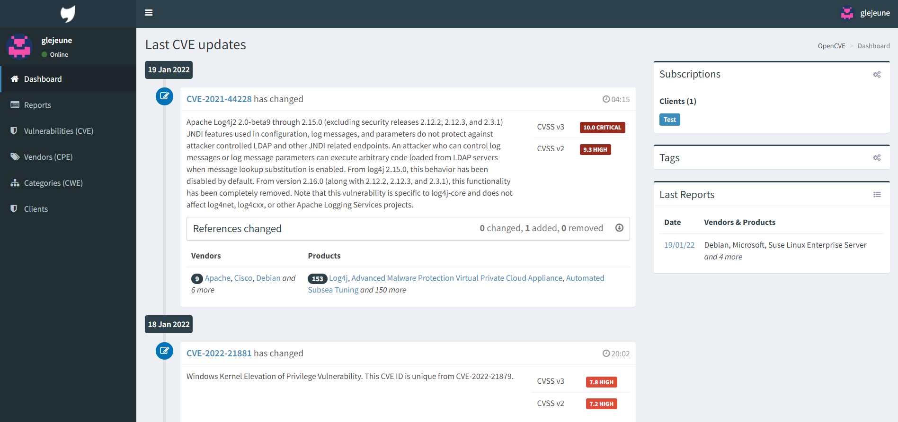
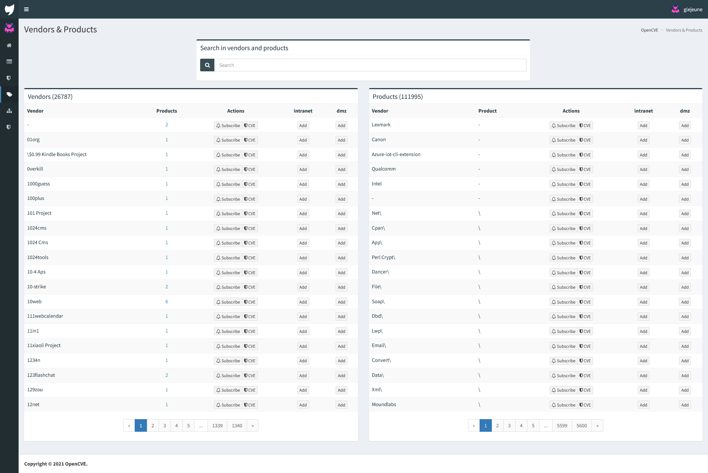

# What is OpenCVE ?

Please refer to [this file](https://github.com/opencve/opencve/blob/master/README.md) to learn more.
If you want to learn more about what it is, and how it works, you can check [the official documentation](https://docs.opencve.io/).
# What is this fork ?

This fork adds several thngs to the OpenCVE project.
- A "category" system.

    You can view this as a "category" feature. The goal is to add a category, and to register several Vendors or products in it. This way, you can follow your category, and be alerted whenever something impacting it happens.

    - You can also add vendors or products to a followed category on the vendor and product list by hand.

- An new import function

    You can import a category's sbscriptions via an Excel file (xlsx) if it's format is correct (column "vendor", "product", "version" and "tag" are required).

If you are having problems with the installation or the deployed platform, email me at gael.lejeune@capgemini.com. 

# Installation
Please keep in mind that project is designed to be installed with [our fork of opencve-docker](https://github.com/Gael-Lejeune/opencve-docker).

If you want to learn more, you can check it [here](https://github.com/Gael-Lejeune/opencve-docker).

# Understanding the code
<p align="center">

</p>

## Tree
```
├───conf
└───opencve
    ├───opencve
    │   ├───api
    │   ├───checks
    │   ├───commands
    │   ├───controllers
    │   ├───migrations
    │   ├───models 
    │   ├───static
    │   ├───tasks 
    │   ├───templates
    │   └───views
```

## api
This folder contains the code for the API of the application.
The API is used to retrieve data from the database via a REST API.
You can find the official API documentation [here](https://docs.opencve.io/api/).
In this fork, the API also includes the category system.

You can request it by using the following URL :
```
http://<your_listening_ip>:<your_port>/api/categories

http://<your_listening_ip>:<your_port>/api/categories/<category_name>
```
You can also request the products or vendors of a category by using the following URL :
```
http://<your_listening_ip>:<your_port>/api/categories/<category_name>/products

http://<your_listening_ip>:<your_port>/api/categories/<category_name>/vendors
```
And as for the products and vendors, you can request the CVEs of the category by using the following URL :
```
http://<your_listening_ip>:<your_port>/api/categories/<category_name>/cve
```

You can also use parameters to filter the results as follows :
```
http://<your_listening_ip>:<your_port>/api/categories/<category_name>/cve?criticality=9.0&period=2
```
Where criticality is the criticality of the CVEs (based on the CVSS score), and period is the number of days since the last update of the CVEs.
## Commands
This folder contains python scripts that are used to interact with the application from the command line.   
An example is create_user.py that is used to create a user:
```
root@df0faac8526d:/app# opencve create-user doc doc@test.com
Password:
Repeat for confirmation:
[*] User doc created.
```
If you want to create a new script, it is as follows   
```python
import click
#Import what you need
@click.command()
@click.argument("arg1")
@click.argument("arg2")
@with_appcontext
def example(arg1,arg2):
    //DO SOMETHING
```

Then add it to the cli.py file   

```python
from opencve.commands.example import example
.
.
.
cli.add_command(example)
```
After building and running the project again, you can access the webserver using :
```
docker exec -it webserver bash
```
and run 
```
opencve example arg1 arg2
```
##### Alternatively, you could use :
```sh
docker exec -it webserver opencve example
```
## Controllers
Contains some backend logic and models controllers.
## Migrations
Contains the migrations files generated when building the project. Those can mostly be ignored as they are automatically generated.
## Models
Models are used to create a table in the database. We can take the category.py as an example:
```python
from opencve.context import _humanize_filter
from opencve.extensions import db
from opencve.models import BaseModel, categories_vendors, categories_products, users_categories


class Category(BaseModel):
    __tablename__ = "categories"

    name = db.Column(db.String(), nullable=False, unique=True)

    # Relationships
    vendors = db.relationship("Vendor", secondary=categories_vendors)
    products = db.relationship("Product", secondary=categories_products)
    users = db.relationship("User", secondary=users_categories)


    @property
    def human_name(self):
        return _humanize_filter(self.name)

    def __repr__(self):
        return "<Category {}>".format(self.name)

```
In this example, the new table Category will inherit the BaseModel columns and will add the columns name, vendors, products and users.   
As you can see, the last three columns are in a relationship with other table and we can assure that using:
```python
from opencve.models import categories_vendors
vendors = db.relationship("Vendor", secondary=categories_vendors)
```
in __init__.py we have:
```python
categories_vendors = db.Table(
    "categories_vendors",
    db.Column(
        "category_id", UUIDType(binary=False), db.ForeignKey("categories.id"), primary_key=True
    ),
    db.Column(
        "vendor_id",
        UUIDType(binary=False),
        db.ForeignKey("vendors.id"),
        primary_key=True,
    ),
)
```
which is used to link category vendors column with the vendors table.
## Tasks 
The task folder contains 3 main scripts , events.py, alerts.py and reports.py. I will explain one by one:

### events.py 
The script will check the nist database to see if there are any new CVEs. If yes, they will be downloaded and added to that database and an event will be created.

### alerts.py 
The script will check if there are any new events, if yes it will create alerts for the concerned users.

### reports.py 
The script will check if there are any new alerts, if yes it will send reports to the concerned users (via the platforme and emails if smtp is configured)

## Templates 
Contains the HTML pages to be rendered. It uses jinja to interact with the views controllers.
## Views
Used to control the templates and provide them with data This is an example:
```python
from flask import request, render_template
from opencve.controllers.main import main
from opencve.controllers.categories import CategoryController #We import the category controller
from opencve.utils import get_categories_letters
@main.route("/categories") #The url of the page
def categories():
    categories, _, pagination = CategoryController.list(request.args)
    return render_template(
        "categories.html", #The path to the template
        categories=categories, # Arguments we can send to the HTML page
        letters=get_categories_letters(),
        pagination=pagination,
    )
```
In the categories.html, we will be able to access the categories variable using jinja:
```jinja

    .
    .
    .
    .

```

# Features that are specific to this fork
Please not that this section is about features that are currently in progress or likely to evolve. This section may not be up to date.

## Category model

```python
from opencve.context import _humanize_filter
from opencve.extensions import db
from opencve.models import BaseModel, categories_vendors, categories_products, users_categories


class Category(BaseModel):
    __tablename__ = "categories"

    name = db.Column(db.String(), nullable=False, unique=True)

    # Relationships
    vendors = db.relationship("Vendor", secondary=categories_vendors)
    products = db.relationship("Product", secondary=categories_products)
    users = db.relationship("User", secondary=users_categories)

    @property
    def human_name(self):
        return _humanize_filter(self.name)

    def __repr__(self):
        return "<Category {}>".format(self.name)
```
In addition, we needed to create categories_vendors, categories_products and users_categories in order to assure the relationship between the category table and vendors, products and users table respectively. We discussed those relationships before and how to create them in the __init__.py file.   

In admin.py, I needed to add the CategoryModelView as below :

```python
from opencve.models.categories import Category
class CategoryModelView(AuthModelView):
    page_size = 20
    create_modal = False
    edit_modal = False
    can_view_details = True
    column_list = ["name", "created_at"]
```

Category tables are now added automatically when building the project.

## Command to create a category
The create_category.py script is used to create a category, it can be used as follows:   
```sh
docker exec -it webserver opencve create-category <category-name>
```
The user is able to manage the category subscribtions :
The user should be created beforehand.
## A view to see all the existing categories

The page templates/categories.html alongside views/category.py and controllers/subscriptions.py are used to view the category table and manage subscribtion for users.

<p align="center">

</p>

It is used exactly like the vendors page but to manage categories.

## A view to see the details of a category and modify it
The user is now able to see and update the category subscribtions manually (we will see that next) or using an excel file.   
We can do that by navigating to "/category/\<category name\>". 
<p align="center">

</p>
Using an excel file (.xlsx), the user can update the category products. The excel file format is described on the web page.
We've implemented a searching algorithm that will look for the product in the database if the tag is not precised. If a tag is precised, it has to be in the database.


The read_excel is the function that will read the excel input and populate the database, it can be found at controllers/categories.py
The searching function can be found in the same file.

For the moment, the function is not perfectly optimized and can only use .xlsx files.
## Updated Dashboard
Updated dashboard to be able to see the CVEs related to a followed category.   
This was done by updating the template/home.html page alongside "controllers/home.py".   
The main code was to check the current user categories and add their respective vendors and products to the vendors list.
<p align="center">

</p>

## Added category Action in vendor and products

If the current user is following a category, he will be able to add new vendors and products to the category subscribtions directly from the vendors or products pages:

<p align="center">

</p>

## Managing reports and emails
In order to create alerts for users subscribed to a category we edited the tasks/alerts.py script
```python
 # Product contains the separator
            if PRODUCT_SEPARATOR in v:
                vendor = Vendor.query.filter_by(
                    name=v.split(PRODUCT_SEPARATOR)[0]
                ).first()
                product = Product.query.filter_by(
                    name=v.split(PRODUCT_SEPARATOR)[1], vendor_id=vendor.id
                ).first()
                categories = Category.query.filter(
                    Category.products.contains(product)
                    ).all()
                for user in product.users:
                    if user not in users.keys():
                        users[user] = {"products": [], "vendors": []}
                    users[user]["products"].append(product.name)
                for category in categories:
                    for user in category.users:
                        if user not in users.keys():
                            users[user] = {"products": [], "vendors": []}
                        users[user]["products"].append(product.name)

            # Vendor
            else:
                vendor = Vendor.query.filter_by(name=v).first()
                categories = Category.query.filter(
                    Category.vendors.contains(vendor)
                    ).all()
                for user in vendor.users:
                    if user not in users.keys():
                        users[user] = {"products": [], "vendors": []}
                    users[user]["vendors"].append(vendor.name)
                for category in categories:
                    for user in category.users:
                        if user not in users.keys():
                            users[user] = {"products": [], "vendors": []}
                        users[user]["vendors"].append(vendor.name)
```
We loop through the user categories and select the vendors and products from them.

This will create a list of users that will receive emails.

# Encountred problems
- When you want to upgrade the DB, you will sadly have to make clean and thus re-import the data. The "import-light" function may be optimized to make it even faster and thus help with this problem.
- Please use info() or logger.info() to debug or display logs as print() may not display correctly